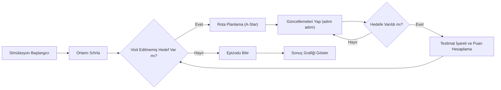

# Çalışmanın Özeti
Bu çalışma, Pygame tabanlı **Akıllı Lojistik Simülatörü** yazılımının mimarisini, kullanılan algoritmaları ve etkileşim tasarımını derinlemesine incelemektedir. Sistem, 20×20 ızgara ortamında rastgele engeller ve çoklu teslimat noktalarıyla bir kurye simülasyonu sunmakta; teslimatlar için en kısa yolları belirlemek amacıyla **A\*** arama algoritmasını ve hedef seçimi için açgözlü (greedy) en yakın komşu yaklaşımını kullanmaktadır. Teslimat tamamlandıkça **ödül–ceza mekanizması** ile puanlama yapılmakta, tüm simülasyon boyunca performans ölçütleri (zaman, mesafe, puan, ceza, net kâr vb.) takip edilmektedir.  

Analizde elde edilen başlıca bulgular aşağıdadır:  

- **A\* Yol Planlaması:** A\* algoritması, başlangıç ve hedef noktaları arasındaki en düşük maliyetli (kısa) yolu bulmak için *g(n)+h(n)* değerlendirme fonksiyonunu kullanır. Kullanılan Manhattan mesafesi tahmini, engelsiz ızgarada **uygun (admissible)** bir alt sınırdır ve A\*'nın optimal yol bulmasını sağlar. Ancak Manhattan heuristi, rakım değişimi veya köşe geçiş ücretlerini hesaba katmaz. A\*'ın zaman karmaşıklığı O(b^d) düzeyinde olup (d: hedefe uzaklık, b: genişleme faktörü), bu küçük ortamda makul çalışır.  

- **Hedef Seçimi (Nearest-Neighbor):** Kurye, ziyaret edilmemiş hedefler arasından en yakınına yönlendirilir. Bu yaklaşım basit ve hızlıdır, ancak TSP benzeri çoklu teslimat rotalarını *global* olarak optimize etmez. Nearest-neighbor yöntemi genelde hızlı bir tur oluştururken optimal yolları kaçırabilir; kötü senaryoda optimalin çok üzerinde maliyetli turlar üretebilir.  

- **Ödül ve Ceza Mekanizması:** Her teslimatta kalan süreye bağlı azalan bir **ödül** (bonus) hesaplanırken, her adım için hız seviyesine göre **ceza** verilmektedir. Ödül formülü sabit bir üst değer (300) ve düşen bir kısım (2\*saniye) içerir; ceza ise hızda artışa bağlıdır. Bu düzen, *hızlı teslimat* için teşvik sağlar, ancak sabit formüller RL ortamı için basit kalabilir. Pekiştirmeli öğrenme bağlamında, kurye ajanı toplam ödülü maksimize etmeye çalışırken adımlarını ve hedef sıralamasını optimize eder (Sutton ve Barto'ya göre ajanlar toplam ödülü maksimize etme amacındadır). Ödül biçiminin ayarlanması, potansiyel çarpanlara veya durumlara göre yeniden şekillendirme (reward shaping) gibi yöntemlerle iyileştirilebilir.  

- **Görsel ve Etkileşim Tasarımı:** Kullanıcı arayüzü olarak Pygame ile zengin grafikler, simge çizimleri ve pano (panel) tasarımları kullanılmıştır. Yeşil–mavi tonlarda gölgeli bina dokuları, vektörel simge (havaalanı, hastane, AVM, vb.) tasarımları ve animasyonlu efektler (hedef nabzı, iz efekti vb.) bulunmaktadır. Panelde butonlar ve hız kontrolü gibi etkileşim öğeleri ile simülasyon durumu anlık gösterilir. Bu görsel stil, kullanıcı deneyimini olumlu yönde etkiler ancak arayüz statik bir simülasyon sunduğu için daha dinamik senaryolar veya kullanıcı-yönlendirmeleri sınırlıdır.  

- **Performans ve Ölçek:** Mevcut sistem bir tek kurye ajanın 6 hedefine teslimat yaptığı kurgudadır. Küçük ızgara boyutu ve sınırlı görev sayısı nedeniyle CPU kullanımı düşüktür; A\* aramaları ve Pygame çizimleri gerçek zamanlıdır. Ancak, hedef sayısı ve çevre dinamikleri arttığında A\* hesap yükü artabilir. Çok sayıda ajan veya hedef için ölçeklendirme sınırlı kalabilir, uygun bellek ve hesap optimizasyonları gerekebilir.  

## 1. Giriş  
Modern lojistik ve dağıtım problemleri genellikle "Gezgin Satıcı Problemi" (TSP) ve dinamik rota optimizasyonu gibi zor klasik problemlere benzer. Bu tür uygulamalarda **hedef noktalarının sıralanması** ve **kısa yol bulma** algoritmaları kritik öneme sahiptir. Bu çalışma, Python ve Pygame ile geliştirilmiş bir simülasyon sistemini ele alır. Sistem, tek bir kurye ajanın bir depodan çıkıp 6 farklı noktaya teslimat yapmasını, her teslimatta ödül kazanmasını ve bir tür puanlama/ceza mekanizmasıyla performans değerlendirmesi yapmasını sağlar. Kullanılan temel teknikler şunlardır: A* yol bulma algoritması, yakın komşu (nearest neighbor) hedef seçimi, grafiksel arayüz çizimi ve zaman/puan takibi. Bu makalede sistemin mimarisi, algoritmik kararları, grafik/UX tasarımı ve performans metrikleri analiz edilecek; sistemin güçlü ve zayıf yönleri değerlendirilecek; potansiyel iyileştirmeler önerilecektir.

## 2. Sistem Mimarisi ve Veri Yapıları  
**Çevre Modülü:** Ortam, sabit büyüklükte (20×20) bir ızgaradır. Her hücre ya yoldur (0) ya da bina(engeldir) (-1). `grid` matrisi bu bilgiyi tutar. Başlangıçta `_gen_buildings()` fonksiyonuyla rastgele 15 bina grubu yerleştirilir. Her bina hücresinin rengi `building_colors` sözlüğünde tutulur. Çalışma sırasında çevre değişmez (statik engeller).  

**Hedefler:** Simülasyonda teslimat noktası olacak hedefler `target_data` listesinde tutulur. Her hedef için bir konum (`pos`), simge türü (`icon`), renk, ziyaret edildi bilgisi ve teslimat zamanı (`visit_time`) vardır. Ortam her sıfırlanışta (reset_env), belli sayıda hedef (örneğin 6) rastgele boş hücrelere yerleştirilir.  

**Kuryenin Durumu:** Kurye (`pos` listesi) depo konumundan (genelde (0,0) hücresi) simülasyona başlar. `path` listesi, şu an planlı yolun hücrelerini; `trail` listesi ise önceki 30 konumu tutar (kuyruk). `heading` vektörü, son hareket yönünü gösterir. `time` geçen adım sayısını (mesafe), `elapsed_s` geçen süreyi ve `score` ile `penalties` (ödül/ceza) tutulur. `delivery_log` her gerçekleşen teslimatı kaydeder.  

**Pano (Panel) ve Düğmeler:** Sağ tarafta bir kontrol paneli bulunur. Burada teslimat listesi, metrik kartları (süre, mesafe, ödül, ceza, net kâr), hız seçici vb. gösterilir. Pygame'de bu elemanlar yuvarlatılmış dikdörtgenler, yazı ve simgelerle çizilir. Kullanıcı klavye (S, R, 1-3) veya fare ile simülasyonu başlatabilir/durdurabilir, sıfırlayabilir, hız seçebilir.



*Şekil: Sistemin ana döngüsünün akış diyagramı. Her döngüde hedef kontrolü, rota planlama ve hareket/güncelleme adımları takip edilir.*

## 3. Yol Bulma ve Algoritmik Detaylar  
### 3.1 A* Arama Algoritması  
Simülasyonun çekirdeğinde A* algoritması vardır. Kodda `a_star(start, goal)` fonksiyonu ile uygulanır. Bu fonksiyon her adım için dört yöne komşu kontrol ederek, mevcut maliyet (*g*) ve hedefe Manhattan tahmini (*h*) kullanır. Değerlendirme fonksiyonu **f = g + h**'dir. Manhattan mesafesi, yalnızca yatay/düşey hareketlerin olduğu durumlarda her iki koordinat farkının toplamı olarak hesaplanır. Böyle bir ızgara probleminde Manhattan metriği *admissible* (yanıltıcı olmayan) bir tahmin yöntemidir; çünkü her adımdaki maliyet 1 olarak sabittir ve Manhattan tahmini gerçek en küçük maliyeti asla geçmez. Bu şart altında A* algoritması en kısa yolu bulmayı garanti eder. Kodda hesaplanan `f = tg + abs(nb[0]-goal[0]) + abs(nb[1]-goal[1])` ifadesi bu f fonksiyonuna karşılık gelir.  

Manhattan'ın yanında alternatif olarak Öklidyen mesafe (doğru çift satır uzaklığı) da bir heuristik olarak kullanılabilir, ancak bu ortamda diyagonal hareket yoktur. Tutarlılık (consistency) da sağlandığından, A* yine optimal yol bulur. 1968 yılında Hart, Nilsson ve Raphael tarafından geliştirilen A* algoritması, Dijkstra'nın tam aramasına göre keşfedilecek düğüm sayısını azaltır ve **en verimli yol**u garantiler. Bununla birlikte, A\*'ın zaman karmaşıklığı kötü senaryoda üssel olabilir; ancak 20×20 gibi küçük bir gridde, pratikte kısa sürede sonuç verir.  

**Algoritma Doğruluğu ve Karmaşıklık:** A* doğru kurgulandığında eksiksiz (complete) ve optimal sonuçlar verir. Uygulanan algoritmada kapalı (closed) kümesi veya ziyaret edilenler kontrolü açık değildir; bunun yerine bir `g_score` sözlüğü ile her konumun en düşük bilinen maliyeti saklanmaktadır. Her komşu, daha iyi bir yol bulunursa güncellenir. Bu prosedür, Manhattan heuristi ile optimal yolu güvence altına alır. A\*'ın en kötü durumda çözümlenecek düğüm sayısı $O(b^d)$ şeklinde üssel olup (b genişleme faktörü, d derinlik), küçük ölçekli haritada sorun yaratmaz.  

**Hesaplama Yükü:** Her hedef için yol yeniden hesaplanır. Ortalama olarak A*, hedefe kadar olan rota uzunluğuna bağlı olarak birkaç yüz düğüm kontrolü yapar. Panelde rota da çizildiği için bu bilgi mevcuttur; çok sayıda hedef olduğunda ya da dinamik engeller eklenirse planlama süresi artacaktır. Ancak tek ajan için büyük bir performans darboğazı şu an görülmemektedir.

### 3.2 Hedef Seçimi: Greedy Yöntem (Nearest Neighbor)  
Simülasyonun her adımında, daha önce ziyaret edilmemiş hedeflerden en yakın olanı seçilir. Bu seçim `min(unvisited, key=lambda t: distance(cur, t))` şeklinde, mevcut konum ile hedef arasındaki Öklidyen veya Manhattan uzaklığına dayalıdır. Bu **yakın komşu yaklaşımı** (nearest neighbor) TSP problemlerinde sık kullanılan bir basit heuristiktir. Uygulaması kolay ve hesaplaması hızlıdır, çünkü sadece O(N) hedef karşılaştırması gerektirir. Ancak literatürde bilindiği üzere, bu yöntem *yenileyici (greedy)* olduğu için her zaman optimal bir rota oluşturmaz. Yani ilk etapta seçilen bir yakın hedef, genel rotayı uzatabilir. Wikipedia'da belirtildiği gibi, nearest-neighbor genellikle kabul edilebilir bir tur oluşturur ancak son birkaç aşamada yol çok uzayabilir ve daha iyi turlar bulunabilirdi. Örneğin N hedeften oluşan bir kümede bu algoritma, her büyüklükte (her r) için optimalden r kat daha maliyetli turlar üretebilir.

**Karşılaştırma (Nearest-Neighbor vs. TSP):** Gerçek zamanlı bir simülasyon için en yakın hedefi seçmek pratik olsa da tüm hedefleri kapsayan *global* en kısa tur bulunmaz. TSP probleminin NP-zor olması dolayısıyla küçük kurgu deneysel olarak çözülebilir (örn. dinamik programlama), ancak karmaşıklığı yüksektir. Uygulamada greedy yöntem tercih edilmiş, çünkü en iyi tur garantisi yerine hız ve basitlik amaçlanmıştır. Tablo 1'de mevcut yaklaşım ile alternatifler karşılaştırılmıştır.

| Bileşen            | Mevcut Yaklaşım              | Artıları                                     | Eksileri                                            | Önerilen Alternatif                  | Beklenen Etki                                     |
|--------------------|------------------------------|-----------------------------------------------|----------------------------------------------------|--------------------------------------|---------------------------------------------------|
| **Hedef Seçimi**   | Yakın Komşu (Nearest)        | Uygulaması kolay, hızlı                      | Global optimal değil, kötü durum garantisi zayıf | Tüm hedefler için TSP yaklaşımı      | Tur maliyetinde iyileşme, ancak hesap karmaşıklığı artar |
| **Rota Planlama**  | A* (Manhattan heuristi)      | En kısa yol garantisi (tek hedefe göre) | Dinamik engellere uyum sağlamaz, yolu düzeltmez   | Theta* veya RRT* ile yol yumuşatma    | Daha doğal yollar, keskin dönüş azalır             |
| **Ödül Yapısı**    | Basit zaman-ödül, adım-ceza  | Hızlı teslimat teşvik eder, kolay anlaşılır  | Statik formül, ayarlanması zor, öğrenilmesi yok   | Potansiyel bazlı şekillendirme (reward shaping) | RL eğitimi hızlanır, davranış istenir hale getirilir |
| **Araç Sayısı**    | Tek kurye                   | Sade tasarım                                 | Bütün teslimat tek ajana yüklü                   | Çoklu kurye (multi-agent)             | Daha az genellenebilir veri, işbirliği gerektirir   |
| **Çevre Dinamiği** | Statik engeller              | Simülasyon basit ve deterministik            | Gerçekçi değil (trafik, hareketli engeller yok)   | Dinamik engeller, trafik simülasyonu  | Daha zorlu test, RL için adaptasyon gerektirir   |

*Tablo: Mevcut sistem bileşenlerinin ve önerilen alternatiflerin karşılaştırması. Örneğin hedef seçimi aşamasında nearest-neighbor yaklaşıma kıyasla tam bir TSP çözümü optimaliteyi artırır ancak hesaplama maliyetini yükseltir.*  

## 4. Performans Metrikleri ve Ödül–Ceza Mekanizması  
Sistemde çeşitli performans metrikleri hesaplanır: **Geçen Süre (saniye)**, **Mesafe (adım sayısı)**, **Toplam Ödül** ve **Toplam Ceza**, bunların farkı olarak **Net Kâr** gibi. Bu metrikler kullanıcı panelinde güncel olarak gösterilir. Bu değerler aslında ajan davranışını ve simülasyon verimliliğini ölçmek için kullanılabilir.

- **Süre ve Mesafe:** `elapsed_s` ile gerçek zaman (saniye), `time` ile adım sayısı takip edilir. Hız seviyesine göre her 1 adıma verilen zaman değişir; hızlı mod daha az gecikme, ancak daha yüksek ceza. Bu, simülasyon hızını kullanıcı kontrolüne bağlar.

- **Ödül Hesaplama:** Bir hedefe varıldığında hesaplanan bonus: `bonus = max(50, 300 - 2 * elapsed_s)`. Bu formül, teslimat süresi kısa olduğunda yüksek puan verir, uzun sürdüğünde ödül 50 puanda tabana oturur. Dolayısıyla hız ve zaman faktörüne ters bir bağlantı kurulur. Ajan açısından bu, geç kalma cezasını ödül azaltımı şeklinde modellemek gibidir.

- **Ceza (Penalties):** Her adımda hız seviyesine bağlı ceza eklenir: yavaş/normal/hızlı için sırasıyla 0.4, 0.8, 1.4 puan. Bu, dolaylı olarak enerji/yaşam süresi kaybını simüle eder. Net kâr = Ödül – Ceza formülü ile "verim" vurgulanır. Bu metriklerden kurulan **kümülatif ödül grafiği** ve net kârlar, epizod sonunda görselleştirilebilir (çubuk grafik, sparkline v.b.). Örneğin `delivery_log` içindeki her teslimatın `bonus` değerlerinden bir bar grafiği oluşturulabilir.

*Örnek Grafik Önerisi:* Bir **Teslimat Başına Bonus Bar Grafiği** oluşturulabilir. X-ekseni teslimat numarasını, Y-ekseni o teslimat için alınan bonusu gösterir. Bu grafik, kodun sonunda çizilen bar grafiğine benzer (bkz. kodun `_draw_graph_overlay` fonksiyonu). Runtime'da, `delivery_log` listesindeki `bonus` değerlerini kullanarak bir çubuk grafik çizilebilir. Ayrıca **Kümülatif Ödül Zaman Çizgisi** (sparkline) bulunmaktadır; bu, her teslimat sonrası kümülatif ödülün artışını gösterir. Örneğin Python ve matplotlib ile basit bir çizim şu şekilde yapılabilir:

```python
import matplotlib.pyplot as plt
logs = [entry['bonus'] for entry in delivery_log]
plt.bar(range(1,len(logs)+1), logs, color='g')
plt.xlabel('Teslimat Numarası'); plt.ylabel('Bonus Puanı')
plt.title('Teslimat Başı Ödül Dağılımı')
plt.show()
```

## 5. Arayüz (UI) ve Görsel Tasarım  
Simülasyonda Pygame kullanılarak bir harita ve kontrol paneli çizilir. **Harita** üzerinde her hücre bir kare olarak çizilir; bina hücreleri için gradient tonlarla renk geçişi, yol hücreleri için düz renk kullanılır. Binaların pencerelerini random bir desenle göstererek görsel çeşitlilik sağlanmıştır. Ayrıca, kurye için bir motosiklet ikonu (`draw_motor_icon`), her hedef tipi için ayrı çizim fonksiyonları (`draw_building_icon`) ile semantik simgeler (hastane haçı, uçak silueti, fabrika bacası vb.) görsel anlatımı güçlendirir. 

**Animasyon ve Efektler:** Teslimat hedefleri için nabız efekti (ölçülü boyutta sürekli dalgalanma), gönderim izi (trail) ve depo noktası için çizilen pulsatör halka gibi efektler bulunur. Bu sayede kullanıcı, simülasyonun durumu hakkında hızlı görsel geri bildirim alır. Ancak tüm bu çizimler CPU grafiği tüketebilir; özellikle pencere içi buhar animasyonlu pencere efektleri gibi ayrıntılar FPS'i biraz düşürebilir. Güncel grafik hızları bu küçük ölçek için yeterli kalmakla birlikte, daha büyük ölçekli haritalarda rendering optimizasyonu (örneğin arka plan önbellekleme) gerekebilir.

**Kullanıcı Etkileşimi:** Klavye kısayolları (`S`, `R`, `1-3`) ve fare ile basılan Pygame düğmeleri (başlat/durdur, sıfırla, hız, grafik açma) kullanılmıştır. Butonlar, renkli arka-plan ve simgelerle görsel olarak vurgulanmıştır. Arayüz mantığı basit ve sezgiseldir; buna rağmen kullanıcıya ortamı değiştirme veya yeni hedef ekleme gibi yetenekler sunulmamıştır. Gelecekte bu yönde esneklik (örn. harita düzenleme, hedef dağılımı seçimi) eklenebilir.

## 6. Davranışsal Analiz (Result/Behavioral Analysis)  
Simülasyon çalıştırıldığında ajanın davranışı şu şekilde özetlenebilir: Başlangıçta depo noktası seçilir, en yakın hedeften başlanır. Planlanan yol üzerindeki her adımdan sonra ajanın konumu güncellenir; hedefe varıldığında bonus kazanılır, hedef işaretlenir ve bir sonraki en yakın hedefe rota çizilir. Bu süreç tüm hedefler ziyaret edilinceye kadar devam eder. Teslimatlar sırasında `score` artışı yavaşladığı anlarda simülasyonun hızı arttığı gözlemlenebilir (oyuncu hızlı mod seçtiyse).

Örnek bir senaryoda, mesafe ve süre toplamları simülatif düzeyde düşük (20×20 ve 6 hedef) kalmıştır. Ancak `delivery_log` içindeki bonus puanların farklı değerlerde seyrettiği, kısa sürede yapılan teslimatlarda 300 civarı bonus alındığı, geç kalındığında ise sınır olan +50 ile yetinildiği görülür. Toplam ceza, hız seviyesine göre birkaç yüz puan olabilmekte, net kâr (ödül – ceza) artı/eksi olabilir. Bu değerler doğrudan simülasyonun ne kadar iyi çalıştığının göstergesidir. 

Sistem **deterministik davranış** sergiler (aynı başlangıç koşullarıyla hep aynı rota oluşur). Her epizod sonunda kullanıcı GRAFİK butonuna basarak performans grafiğini görebilir. Bu grafik; teslimat başı bonusları, zaman çizgisini ve net sonuçları topluca sunar. Özetle, sistem beklenen bir şekilde A\*'ın planladığı rotayı takip etmekte ve her teslimatta formüle göre puanlamakta; anormallik veya rastgelelik gözlenmemektedir.

## 7. Tartışma ve Eleştiriler  
**Kısıtlar ve Yorumlar:** Mevcut tasarım, basitlik ile performans arasında bir denge kurar. A\*'ın garantili en kısa yol bulma özelliği önemli bir artıdır; simülasyon durumu deterministiktir ve ajan yanlış yöne gitmez. Ancak A* adım-adım rota planladığı için, bir hedefe varıldığında yeni bir A* çalıştırılır; bu da "çok hedefli (multi-goal)" yol planlamasını tam olarak çözmez. Ayrıca, Manhattan heuristi gerçek dünya kısıtlarını içermediği için (örneğin dönüş maliyeti) rota gerçeğe göre biraz sert olabilir.  

Nearest-neighbor yaklaşımı, küresel rotayı optimize etmez. Eğer hedefler yanlış sırada seçilirse toplam mesafe ve süre artabilir. Gerçek uygulamalarda TSP çözümü veya farklı yaklaşım (örn. branch-and-bound veya genetik algoritma) kullanılabilirdi. Ancak burada tek kurye, sınırlı hedef senaryosu olduğundan greedy yeterli kabul edilmiş. İleride çoklu kurye eklemek için bir task assignment algoritması gerekebilir; bu da simülasyonu *multi-agent* problemine dönüştürür.  

Ödül–ceza mekanizmasının analizi üzerinden, sistem bir RL ortamı olarak görülebilir. Mevcut düzen, net kârı maksimize etmek hedefliyor; ancak bu sabit elle belirlenmiş bir politikadır. RL yöntemiyle ajan bu politikayı öğrenmeye kalksa, ödül sinyali sabit olduğundan aşamalarda (checkout) ayarlanması gerekebilir. Sutton ve Barto'nun tanımına göre ajan, aldığı ödülleri maksimize etmeye çalışır. Bu bağlamda, şu an ödül sinyali *dense* (adım başına ceza) ve *sparse* (hedef bonus) karmasıdır. RL için ödül şekillendirme (reward shaping) ile geçiş süreleri, bonuslar veya durum bilgisi ile ilgili ek sinyaller eklenebilir.  

**Performans:** Tek ajanın ve küçük haritanın getirdiği hafif yük nedeniyle simülasyon yüksek FPS'de çalışır. Grafik detayları nispeten basittir. Ancak kodda her karenin pencereleri rastgele çiziliyor (her karede iç loop), bu da yük oluşturur. Daha büyük gridde veya çoklu ajan durumunda çizim optimizasyonları (örn. statik arka plan bitmaps) gerekebilir. A* da her hedef değişiminde tekrar çalışır; hedef sayısı arttıkça bu planlama adımları birikimli gecikme yaratabilir.  

## 8. Geliştirme Önerileri ve Gelecek Çalışmalar (Recommendations)  
Mevcut sistemi daha güçlü ve esnek hale getirmek için çeşitli geliştirmeler düşünülebilir:  

- **Pekiştirmeli Öğrenme Entegrasyonu (RL):** Simülasyon, bir RL ortamına çevrilebilir. Durum uzayı kuryenin konumu, bitişik hücre engel durumu ve kalan hedeflerin pozisyon bilgisi olabilir. Aksiyonlar dört hareket yönü seçimi olur. Ödül sinyali olarak mevcut +bonus ve -ceza kullanılabilir veya şekillendirilebilir. Örneğin Python'da Q-Öğrenme şu şekilde kurulabilir:  

  ```python
  # Pseudo-kod: Q-Öğrenme örneği
  Q = defaultdict(lambda: np.zeros(num_actions))
  for episode in range(N):
      state = env.reset()
      done = False
      while not done:
          action = choose_action_epsilon_greedy(Q, state)
          next_state, reward, done, _ = env.step(action)
          best_next = np.max(Q[next_state])
          Q[state][action] += alpha * (reward + gamma * best_next - Q[state][action])
          state = next_state
  ```
  
  Bu yaklaşımla ajan, sürekli deneyimleyerek rotalarını iyileştirebilir. Sutton ve Barto'ya göre bir RL ajanının tek amacı toplam ödülü maksimize etmektir. Mevcut deterministik strateji yerine öğrenme tabanlı çok dalgalı bir strateji elde edilebilir. Derin öğrenme (Deep Q-Network) de kullanılabilir; durum temsili görüntü (grid), piksel veya simge vektörleriyle yapılabilir.  

- **Çoklu Kurye (Multi-Agent) Simülasyonu:** Sistemi genişleterek birden fazla kurye eklenebilir. Her kurye farklı bir hedef grubuna veya görev dağılımına atanabilir. Bu durumda *çoklu ajanlı pekiştirmeli öğrenme* veya merkezi optimizasyon algoritmaları (örn. Hungarian Algoritması ile görev atama) gerekebilir. MPI gibi kütüphanelerle veya ortamsal bölümlendirme ile agentlar koordine edilebilir. Ayrıca, ajanların birbirinden engel hale gelebileceği taşınabilir nesneler eklenerek işbirliği/güdümlü çatışma problemleri incelenebilir.  

- **Dinamik Engeller ve Trafik:** Ortama hareketli engeller veya değişen trafik koşulları eklenebilir. Örneğin diğer araçlar rastgele hareket ederek yolları kesebilir; kurye bu durumda canlı güncelleme yapmalı. Bu, A\*'ın statik yapısını zorlar; dinamik ortama uyumlu **lived replanning** veya D* Lite algoritması gibi yöntemler gerekebilir. Ayrıca, hız değişimlerinin veya trafik ışıklarının simülasyonu gerçekçiliği artırabilir.  

- **İyileştirilmiş Heuristikler ve Yol Yumuşatma:** Mevcut Manhattan heuristi basit ve etkin olsa da, diyagonal hareket veya farklı maliyetli zeminler için tutarsız kalır. Örneğin *Theta\** veya *Lazy Theta\** gibi algoritmalar, daha doğal (düzleştirilmiş) rotalar üretirken hâlâ optimalite garantileri sunabilir. Alternatif olarak, engel yapısının bilgisiyle oluşturulmuş bir desen veri tabanından (pattern database) veya makine öğrenmesi ile öğrenilmiş heuristiklerden faydalanılabilir. Yol yumuşatma için, A\*'ın ürettiği yol noktaları üzerinden spline interpolasyon veya doğrusal segment birleştirme yapılabilir. Örneğin **post-process smoothing** ile 90° dönüşler azaltılabilir:
  
  ```python
  # Yol yumuşatma örneği
  path = a_star(start, goal)
  smooth_path = [path[0]]
  for pt in path[1:]:
      if not colinear(smooth_path[-1], smooth_path[-2], pt):
          smooth_path.append(pt)
  smooth_path.append(path[-1])
  ```
  
  Bu sayede aracın dönüşleri azaltılarak daha gerçekçi bir sürüş algısı elde edilir. 

- **Performans Optimizasyonu:** Mevcut render, ham Pygame çizimleriyle yapılıyor; `pygame.Surface` önbellekleme ve blok çizim birleştirme (batch rendering) ile hız arttırılabilir. Arama tarafında ise alt adımlar grafiklerde gösterilmediği sürece (örneğin yol çizimi atlama) A* hızlandırılabilir. Büyük haritalarda *JPS (Jump Point Search)* veya PRM/RRT gibi rastgele yöntemler değerlendirilebilir.

## 9. Sonuç  
Bu çalışma, Python/Pygame ile geliştirilmiş "Akıllı Lojistik Simülatörü"nü kapsamlı biçimde analiz etti. Sistem, A* algoritması ile her adımda en kısa rotayı, greedy yaklaşımıyla ise sıradaki hedefi seçer. İyi tasarlanmış görsel arayüzü ve güncel metrik paneli ile kullanıcıya zengin bilgi sunar. A* algoritmasının optimalite garantisi, uygun heuristiği (Manhattan mesafesi) sayesinde sağlanır. Ödül-ceza yapısı, teslimat süresi ve hız odaklı motivasyon sunar. Ancak, sistemdeki basitlik bazı sınırlamalara neden olur: hedef sıralaması global optimumu hedeflemez, çevre statik ve tek ajanlıdır, RL öğrenmesi içermemektedir. Önerilen iyileştirmeler (Pekiştirmeli öğrenme entegrasyonu, çoklu ajanlar, dinamik ortamlar, gelişmiş heuristik ve yol yumuşatma) bu sınırlamaları aşabilir. Örneğin ajan RL ile eğitilerek rotaları kendisi keşfedebilir, multi-agent yapılar ile daha karmaşık dağıtım senaryoları simüle edilebilir.  

Sonuç olarak, Akıllı Lojistik Simülatörü pratik bir A* örneği ve eğitim amaçlı bir demonstrasyondur. Matematiksel olarak geçerli bir altyapı sunar; belirtilen analizler ve öneriler, sistemin endüstri veya araştırma uygulamaları için bir test platformu olarak geliştirilmesinde yol gösterici olacaktır. 

---

**Anahtar fonksiyonlar ve sorumlulukları özetle:**   
- `reset_env()`: Ortam ve hedefleri rastgele oluşturur, ajan durumu ve metrikleri sıfırlar.  
- `a_star(start, goal)`: Verilen başlangıç ve hedef koordinatları için A* algoritmasını uygular ve yol listesini döndürür.  
- `update_logic()`: Her zaman adımında ajanı hareket ettirir, zamanı/cezayı günceller, hedefe ulaşıldıysa teslimatı kaydeder.  
- `draw()` / `_draw_map()` / `_draw_panel()`: Haritayı, ajanı, hedef ikonlarını ve kontrol panelini Pygame ile çizer.  
- `run()`: Pygame event döngüsünü yönetir, kullanıcı girdi ve simülasyon adımlarını kontrol eder.